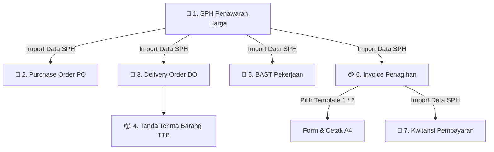

# 📋 SPESIFIKASI ARSITEKTUR TEKNIS
## MULTI-TENANT ENTERPRISE ERP SYSTEM
### (AUTHENTICATION, ROLES, IMPERSONATION, DOKUMEN OPERASIONAL & MYSQL BACKEND)

> **Versi Dokumentasi:** 1.0.0  
> **Status:** Disetujui (Approved Specification)  
> **Database Server:** MySQL Database (`enterprise_db`)  

---

## 1. 🌐 GAMBARAN UMUM SISTEM (EXECUTIVE SUMMARY)

Sistem dirancang sebagai **Multi-Tenant SaaS Enterprise ERP Platform** terisolasi penuh yang memungkinkan pengelolaan **banyak perusahaan sekaligus (Multi-Company)**. 

Sistem ini mencakup autentikasi akun pengguna per perusahaan, role **Super Admin** dengan fitur **User Impersonation**, serta siklus lengkap dokumen bisnis dari **Penawaran Harga** (dengan status *Inisiasi*, *Nego*, *Closing*), **Purchase Order (PO)**, **Delivery Order (DO)**, **Tanda Terima Barang (TTB)**, **Berita Acara Serah Terima (BAST)**, **Invoice (Faktur Penagihan)**, hingga **Kwitansi Pembayaran**.

---

## 2. 📱 NAVIGASI & STRUKTUR MODUL APLIKASI (12 MENU UTAMA)

Sidebar navigasi akan menampilkan modul berdasarkan hak akses peran (*Role-Based Access Control*):

```
┌───────────────────────────────────────────────────────────┐
│ 🏢 MULTI-COMPANY ENTERPRISE ERP                          │
├───────────────────────────────────────────────────────────┤
│ [ KHUSUS SUPER ADMIN ]                                    │
│  👑 User Management (Akun & Impersonate)                  │
│  🏢 Master Perusahaan (Profil Perusahaan)                 │
│                                                           │
│ [ OPERASIONAL PERUSAHAAN (TENANT SCOPE) ]                 │
│  1. 📝 Penawaran (Quotation Builder)                      │
│  2. 📜 Riwayat Penawaran (Inisiasi / Nego / Closing)       │
│  3. 📄 Purchase Order (PO)                                │
│  4. 🚚 Delivery Order (DO / Surat Jalan)                  │
│  5. 📦 Tanda Terima Barang (TTB)                          │
│  6. 📑 BAST (Berita Acara Serah Terima)                   │
│  7. 💳 Invoice (Faktur Penagihan)                         │
│  8. 🧾 Kwitansi (Tanda Terima Pembayaran)                 │
│  9. 👥 Master Customer                                    │
│ 10. 🏭 Master Vendor                                      │
└───────────────────────────────────────────────────────────┘
```

---

## 3. 📋 SPESIFIKASI DETAIL MASING-MASING MENU (12 MODUL APLIKASI)

Berikut adalah rincian spesifikasi fungsi, input form, alur kerja, dan output dokumen untuk setiap menu dari 12 modul aplikasi Enterprise ERP:

### 1. 👑 Menu User Management (Akun & Impersonate)
- **Akses Role:** `SUPER_ADMIN`
- **Tujuan Modul:** Mengelola akun pengguna di seluruh perusahaan serta menyediakan fitur Impersonasi (*Masuk Sebagai*).
- **Fitur Utama:**
  - Pendaftaran pengguna baru (`COMPANY_ADMIN` atau `COMPANY_STAFF`) dengan pemetaan `company_id`.
  - Tombol **`🔑 Impersonate / Masuk Sebagai`** pada setiap baris user perusahaan.
  - Reset password pengguna & pengubahan status akun (`active` / `inactive`).
- **Komponen Input Form:** Username, Email, Password, Nama Lengkap, Perusahaan Target (Dropdown Select), Role, Status.
- **Tabel UI:** Nama User, Email, Perusahaan, Role, Status, Action Buttons (`Edit`, `Reset Pass`, `🔑 Impersonate`).
- **Aturan Bisnis Impersonasi:** Saat Super Admin menekan *Impersonate*, sistem menerbitkan JWT token temporary dengan scope `company_id` target dan menampilkan banner status berwarna kuning/merah: `⚠️ Mode Impersonasi Aktif: PT. ABC [ Hentikan Impersonasi ]`.

---

### 2. 🏢 Menu Master Perusahaan (Profil Perusahaan)
- **Akses Role:** `SUPER_ADMIN` (Full CRUD All Companies), `COMPANY_ADMIN` (Read & Update Profil Perusahaan Sendiri).
- **Tujuan Modul:** Mengelola identitas resmi perusahaan penyedia/penerbit dokumen penawaran & penagihan.
- **Fitur Utama:**
  - Pengisian data legalitas (Nama PT/CV, Alamat, NPWP, Kontak).
  - Upload Logo Resmi (Format PNG/SVG/Base64).
  - Upload Stempel & TTD Penanggung Jawab default.
  - Konfigurasi Rekening Bank resmi untuk tujuan transfer pembayaran penagihan.
  - Pengaturan Awalan (*Prefix*) Nomor Dokumen (`SPH`, `PO`, `DO`, `TTB`, `INV`, `KWT`).
- **Output:** Menyediakan data Kop Perusahaan, Logo, Stempel, TTD, dan Rekening Bank secara otomatis pada seluruh dokumen penawaran, PO, DO, TTB, Invoice, dan Kwitansi.

---

### 3. 📝 Menu Penawaran (Quotation Builder)
- **Akses Role:** `COMPANY_ADMIN`, `COMPANY_STAFF`
- **Tujuan Modul:** Membuat dokumen **Surat Penawaran Harga (SPH)** interaktif berbasis **Word-Style Dynamic Table Builder**.
- **Fitur Utama:**
  - Header Surat: Nomor Penawaran, Tanggal, Perihal, Lampiran, Judul Lampiran.
  - Data Klien: Pilih dari Master Customer atau Input Manual.
  - **Desainer Kolom Tabel (Word Style):** Tambah Kolom N-Jumlah, Atur Judul Header, Lebar (%), Alignment (Kiri/Tengah/Kanan), Tipe Data (Teks, Angka, Rp, Formula Total), serta Tombol `⚖️ Auto Balance (100%)`.
  - Editor Baris Item: Textarea Deskripsi Pekerjaan, Input Dinamis per Kolom, Tambah/Hapus Baris.
  - Opsi Tampilan: Toggle Total Keseluruhan (Grand Total).
  - Narasi Surat: Pembuka, Body Multi-Paragraf, Penutup.
  - TTD & Stempel: Nama Penanda Tangan, Jabatan, Custom Upload Gambar TTD & Stempel.
- **Output:** Live Preview 2 Lembar A4 (Lembar 1: Surat Pengantar, Lembar 2: Spesifikasi & Rincian Harga) + Export PDF.

---

### 4. 📜 Menu Riwayat Penawaran (Inisiasi / Nego / Closing)
- **Akses Role:** `COMPANY_ADMIN`, `COMPANY_STAFF`
- **Tujuan Modul:** Monitoring pipeline dan pengarsipan seluruh penawaran harga berdasarkan status transaksi.
- **Tiga Status Pipeline Utama:**
  1. **`Inisiasi`:** Penawaran baru dibuat dan dikirim ke calon pelanggan.
  2. **`Nego`:** Penawaran dalam proses negosiasi harga/spesifikasi.
  3. **`Closing`:** Penawaran disetujui pelanggan (Deal).
- **Fitur Utama:**
  - Filter berdasarkan Status (`Inisiasi`, `Nego`, `Closing`), Rentang Tanggal, & Pencarian Nama Customer.
  - **Fitur Duplikat Penawaran:** Menyalin struktur penawaran lama menjadi penawaran baru.
  - **Generate Dokumen Lanjutan:** Penawaran bersatus *Closing* langsung dapat dikonversi menjadi dokumen lanjutan (**PO**, **DO**, **TTB**, **BAST**, atau **Invoice**) dengan 1 klik tombol.

---

### 5. 📄 Menu Purchase Order (PO)
- **Akses Role:** `COMPANY_ADMIN`, `COMPANY_STAFF`
- **Tujuan Modul:** Membuat dokumen pemesanan barang/jasa kepada Supplier/Vendor.
- **Fitur Utama:**
  - Pengisian Nomor PO, Tanggal PO, dan Vendor Rujukan (Select dari Master Vendor).
  - Konversi item dari SPH Status *Closing* atau input manual item pemesanan.
  - Pengaturan Estimasi Pengiriman (*Delivery Date*) & Term Pembayaran (TOP / Cash).
  - Rincian Tabel: Nama Barang, Qty, Satuan, Harga Satuan, Total Rp.
  - TTD Otorisasi Purchasing/Manager.
- **Output:** Dokumen Resmi PO A4 cetak/PDF untuk dikirim ke Vendor.

---

### 6. 🚚 Menu Delivery Order (DO / Surat Jalan)
- **Akses Role:** `COMPANY_ADMIN`, `COMPANY_STAFF`
- **Tujuan Modul:** Membuat Surat Jalan Logistik untuk pengiriman fisik barang/peralatan ke lokasi Customer.
- **Fitur Utama:**
  - Pengisian Nomor DO, Tanggal Pengiriman, Rujukan SPH/PO.
  - Data Pengiriman: Alamat Tujuan, Nama Supir/Driver, Plat Nomor Armada.
  - Tabel Barang Dikirim: Nama Barang, Qty Diterbitkan, Satuan, Keterangan Kondisi Kemasan.
  - Tanda Tangan 3 Pihak: Pengirim (Driver), Mengetahui (Gudang/Satpam), Penerima (Klien).
- **Output:** Cetak Surat Jalan A4 3 Rangkap (Putih: Klien, Merah: Supir, Kuning: Arsip Perusahaan).

---

### 7. 📦 Menu Tanda Terima Barang (TTB)
- **Akses Role:** `COMPANY_ADMIN`, `COMPANY_STAFF`
- **Tujuan Modul:** Berita Acara Penerimaan Fisik Barang/Material dari Vendor atau Penyerahan Barang di Lokasi Proyek.
- **Fitur Utama:**
  - Pengisian Nomor TTB, Tanggal Penerimaan, Nomor Rujukan PO/DO.
  - Identitas Pihak: Nama Pengirim, Nama Penerima, Lokasi Gudang/Proyek.
  - Tabel Item Penerimaan: Nama Barang, Qty Dipesan, Qty Diterima, Satuan, Status Kondisi (*Baik / Rusak / Kurang*), & Catatan Fisik.
  - Tanda Tangan 3 Pihak: Penerima Barang, Pengirim Barang, dan Mengetahui (Gudang/Manager).
- **Output:** Dokumen Berita Acara TTB A4 sebagai bukti penerimaan fisik inventaris yang sah.

---

### 8. 📑 Menu BAST (Berita Acara Serah Terima)
- **Akses Role:** `COMPANY_ADMIN`, `COMPANY_STAFF`
- **Tujuan Modul:** Dokumen legal serah terima penyelesaian pekerjaan/proyek 100% dari Perusahaan ke Customer.
- **Fitur Utama:**
  - Pengisian Nomor BAST, Tanggal BAST, Rujukan SPH/Kontrak.
  - Detail Proyek: Nama Pekerjaan/Proyek, Lokasi Pekerjaan, Uraian Ruang Lingkup Pekerjaan.
  - Pernyataan Resmi bahwa pekerjaan telah diperiksa dan diterima dengan baik.
  - Tanda Tangan Pihak Pertama (Pelaksana Pekerjaan) & Pihak Kedua (Customer).
- **Output:** Dokumen Legal BAST A4 sebagai syarat utama penerbitan Invoice Penagihan.

---

### 9. 💳 Menu Invoice (Faktur Penagihan)
- **Akses Role:** `COMPANY_ADMIN`, `COMPANY_STAFF`
- **Tujuan Modul:** Penerbitan Faktur Penagihan Resmi pembayaran pekerjaan/barang kepada Customer.
- **Pilihan 2 Template Invoice (Dual Template Picker):**
  1. **Template 1 (Heksa Standard):**
     - Sub-header metadata SPK/PO, Tanggal SPK/PO, Currency (IDR), Metode Pembayaran.
     - Tabel Rincian: `No | Nama Barang | Vol | Satuan | Harga | Sub Total`.
     - Rincian Total Kanan Bawah: `Total Rp`, `DP (%) Rp`, `Disc Rp`, `Total DPP Rp`, `Pajak PPN (Dinamis %) Rp`, `Total Invoice Rp`.
     - Terbilang Rupiah Otomatis, Catatan Transfer Bank Mandiri, Stempel Basah & TTD Direktur.
  2. **Template 2 (Proforma / MTU Standard):**
     - Customer Details Box (Nama, Alamat, Telepon, TOP - Terms of Payment, Shipped To Box).
     - Metadata: Date, Due Date, Invoice No, Cust PO No, Sales Name.
     - Tabel Rincian: `No | Part Number | Item Name | Qty | Unit | Price | Sub Total | Total After Disc.`.
     - Rincian Total: `Total`, `Tax`, `Sub Total` + Box Informasi Rekening BCA & Mandiri, Box "Barang yang telah dibeli tidak dapat dikembalikan", Received By Box & Sincerely Signature Box.
- **Fitur Utama & Sinkronisasi SPH:**
  - Dropdown **`[ Import Data dari SPH Penawaran: (Pilih SPH) ]`** untuk mengisi otomatis Nama Customer, Alamat, Rincian Barang, Harga, & Qty dari SPH.
  - Form Pemilihan Template (`template_type`: `TEMPLATE_1_HEKSA` vs `TEMPLATE_2_MTU`).
  - Nomor Invoice (Diisi Manual/Bebas), Tanggal Invoice, Jatuh Tempo (*Due Date*), Rujukan BAST/SPH.
  - **Kalkulasi Penagihan & PPN Kustom:** Subtotal, Persentase PPN Kustom (0%, 11%, 12% atau kustom), Kalkulasi PPN, Potongan DP/Diskon, Grand Total Penagihan (Rp).
  - Status Pembayaran: `Unpaid` (Belum Bayar), `Partially Paid` (Bayar Sebagian), `Paid` (Lunas), `Cancelled`.
- **Output:** Cetak Faktur Invoice A4 presisi sesuai template pilihan.

---

### 10. 🧾 Menu Kwitansi (Tanda Terima Pembayaran)
- **Akses Role:** `COMPANY_ADMIN`, `COMPANY_STAFF`
- **Tujuan Modul:** Bukti pelunasan/penerimaan uang pembayaran yang sah atas Invoice yang telah dibayar.
- **Fitur Utama:**
  - Nomor Kwitansi, Tanggal Pembayaran, Rujukan Nomor Invoice.
  - Field *"Sudah Diterima Dari"*: Nama Customer/Pembayar.
  - Field Nominal (Rp) & **Auto-convert Terbilang** (Mengubah nominal angka menjadi kalimat ucapan e.g., *"Satu Juta Lima Ratus Ribu Rupiah"*).
  - Field *"Untuk Pembayaran"*: Uraian transaksi.
  - Metode Pembayaran: Transfer Bank / Tunai / Cek.
  - TTD Penerima & Stempel Basah Perusahaan.
- **Output:** Dokumen Bukti Kwitansi Resmi A4 / A5.

---

### 11. 👥 Menu Master Customer
- **Akses Role:** `COMPANY_ADMIN`, `COMPANY_STAFF`
- **Tujuan Modul:** Basis data pelanggan (Klien/Instansi/Perusahaan) milik tenant.
- **Fitur Utama:**
  - Data Pelanggan: Kode Customer, Nama Perusahaan/Instansi, Contact Person (CP), Telepon, Email, Alamat Lengkap, NPWP.
  - Auto-complete pada saat pembuatan Penawaran, DO, BAST, & Invoice.
- **Output:** Database Customer terisolasi per `company_id`.

---

### 12. 🏭 Menu Master Vendor
- **Akses Role:** `COMPANY_ADMIN`, `COMPANY_STAFF`
- **Tujuan Modul:** Basis data pemasok/supplier/subkontraktor milik tenant.
- **Fitur Utama:**
  - Data Vendor: Kode Vendor, Nama Vendor/Supplier, Contact Person (CP), Kategori Vendor (Material/Jasa/Sewa), Alamat, Telepon, Email, Rekening Bank Vendor.
  - Auto-complete pada saat pembuatan Purchase Order (PO) & TTB.
- **Output:** Database Vendor terisolasi per `company_id`.

---

## 4. 👥 MODUL AUTENTIKASI, ROLES & IMPERSONASI

### A. Peran Pengguna (User Roles)
1. **`SUPER_ADMIN`:**
   - Memiliki akses penuh mengelola daftar Perusahaan (`master_companies`) dan Manajemen Akun (`users`).
   - Memiliki tombol **"🔑 Impersonate / Masuk Sebagai"** pada menu User Management untuk mengoperasikan aplikasi atas nama perusahaan mana pun.
2. **`COMPANY_ADMIN` / `COMPANY_STAFF`:**
   - Terikat secara ketat pada `company_id` masing-masing.
   - Hanya dapat membaca, membuat, dan mengedit data milik perusahaannya sendiri.

### B. Indikator Mode Impersonasi UI
Saat Super Admin mengaktifkan fitur impersonasi, header aplikasi akan menampilkan banner status khusus:
`⚠️ Mode Impersonasi Aktif: PT. ABC [ Hentikan Impersonasi ]`

---

## 5. 🔄 SIKLUS DOKUMEN & DOKUMEN TANDA TERIMA BARANG (TTB)



### 🔗 Fitur Sinkronisasi Data SPH (End-to-End Integration):
1. **Dropdown Import Data SPH Penawaran:** Setiap pembuatan PO, DO, TTB, BAST, Invoice, & Kwitansi dilengkapi opsi dropdown **`[ 🔗 Import Data dari SPH Penawaran ]`**.
2. **Auto Pre-Fill Data:**
   - Nama Customer / Klien & Alamat Klien otomatis terisi dari SPH.
   - Tabel Pekerjaan / Rincian Barang (Item, Deskripsi, Qty, Satuan, Harga Satuan, Subtotal) otomatis ter-copy dari SPH.
   - Nomor Rujukan (`ref_no` / `quotation_id`) otomatis saling terhubung.
3. **Fleksibilitas Pengeditan:** Setelah data di-import dari SPH, pengguna tetap dapat mengubah nominal, menambah catatan khusus, atau memilih **Template 1 (Heksa)** vs **Template 2 (MTU)** pada Invoice.

---

## 6. 🗄️ SKEMA DATABASE MYSQL (`enterprise_db`)

### A. Tabel Autentikasi & User Management

```sql
-- Tabel Profil Perusahaan
CREATE TABLE IF NOT EXISTS master_companies (
    id INT AUTO_INCREMENT PRIMARY KEY,
    company_code VARCHAR(30) UNIQUE NOT NULL,
    company_name VARCHAR(150) NOT NULL,
    legal_name VARCHAR(150),
    address TEXT,
    phone VARCHAR(30),
    email VARCHAR(100),
    npwp VARCHAR(50),
    logo_data LONGTEXT,
    stamp_data LONGTEXT,
    default_signer_name VARCHAR(100),
    default_signer_role VARCHAR(100),
    bank_name VARCHAR(50),
    bank_account_no VARCHAR(50),
    bank_account_name VARCHAR(100),
    doc_prefix VARCHAR(20) DEFAULT 'SPH',
    created_at TIMESTAMP DEFAULT CURRENT_TIMESTAMP,
    updated_at TIMESTAMP DEFAULT CURRENT_TIMESTAMP ON UPDATE CURRENT_TIMESTAMP
);

-- Tabel Pengguna & Akun Perusahaan
CREATE TABLE IF NOT EXISTS users (
    id INT AUTO_INCREMENT PRIMARY KEY,
    company_id INT NULL,
    username VARCHAR(50) UNIQUE NOT NULL,
    email VARCHAR(100) UNIQUE NOT NULL,
    password_hash VARCHAR(255) NOT NULL,
    full_name VARCHAR(100) NOT NULL,
    role ENUM('SUPER_ADMIN', 'COMPANY_ADMIN', 'COMPANY_STAFF') NOT NULL DEFAULT 'COMPANY_ADMIN',
    status ENUM('active', 'inactive') DEFAULT 'active',
    created_at TIMESTAMP DEFAULT CURRENT_TIMESTAMP,
    updated_at TIMESTAMP DEFAULT CURRENT_TIMESTAMP ON UPDATE CURRENT_TIMESTAMP,
    FOREIGN KEY (company_id) REFERENCES master_companies(id) ON DELETE CASCADE
);
```

---

### B. Tabel Master & Transaksi Tenant (`company_id` Enforced)

```sql
-- Tabel Master Customer
CREATE TABLE IF NOT EXISTS master_customers (
    id INT AUTO_INCREMENT PRIMARY KEY,
    company_id INT NOT NULL,
    code VARCHAR(30) NOT NULL,
    company_name VARCHAR(150) NOT NULL,
    contact_person VARCHAR(100),
    address TEXT,
    phone VARCHAR(30),
    email VARCHAR(100),
    npwp VARCHAR(50),
    created_at TIMESTAMP DEFAULT CURRENT_TIMESTAMP,
    updated_at TIMESTAMP DEFAULT CURRENT_TIMESTAMP ON UPDATE CURRENT_TIMESTAMP,
    FOREIGN KEY (company_id) REFERENCES master_companies(id) ON DELETE CASCADE
);

-- Tabel Master Vendor
CREATE TABLE IF NOT EXISTS master_vendors (
    id INT AUTO_INCREMENT PRIMARY KEY,
    company_id INT NOT NULL,
    code VARCHAR(30) NOT NULL,
    vendor_name VARCHAR(150) NOT NULL,
    contact_person VARCHAR(100),
    category VARCHAR(80),
    address TEXT,
    phone VARCHAR(30),
    email VARCHAR(100),
    bank_name VARCHAR(50),
    bank_account VARCHAR(50),
    created_at TIMESTAMP DEFAULT CURRENT_TIMESTAMP,
    updated_at TIMESTAMP DEFAULT CURRENT_TIMESTAMP ON UPDATE CURRENT_TIMESTAMP,
    FOREIGN KEY (company_id) REFERENCES master_companies(id) ON DELETE CASCADE
);

-- Tabel Quotations (Penawaran Harga)
CREATE TABLE IF NOT EXISTS quotations (
    id INT AUTO_INCREMENT PRIMARY KEY,
    company_id INT NOT NULL,
    quotation_no VARCHAR(50) UNIQUE NOT NULL,
    quotation_date DATE NOT NULL,
    customer_id INT,
    customer_name VARCHAR(150) NOT NULL,
    customer_address TEXT,
    annex_title VARCHAR(255) DEFAULT 'SPESIFIKASI PEKERJAAN DAN RINCIAN HARGA',
    status ENUM('inisiasi', 'nego', 'closing') DEFAULT 'inisiasi',
    show_grand_total TINYINT(1) DEFAULT 1,
    custom_columns JSON NOT NULL,
    items JSON NOT NULL,
    notes JSON,
    signer_name VARCHAR(100),
    signer_role VARCHAR(100),
    created_at TIMESTAMP DEFAULT CURRENT_TIMESTAMP,
    updated_at TIMESTAMP DEFAULT CURRENT_TIMESTAMP ON UPDATE CURRENT_TIMESTAMP,
    FOREIGN KEY (company_id) REFERENCES master_companies(id) ON DELETE CASCADE,
    FOREIGN KEY (customer_id) REFERENCES master_customers(id) ON DELETE SET NULL
);

-- Tabel Purchase Orders (PO)
CREATE TABLE IF NOT EXISTS purchase_orders (
    id INT AUTO_INCREMENT PRIMARY KEY,
    company_id INT NOT NULL,
    po_no VARCHAR(50) UNIQUE NOT NULL,
    po_date DATE NOT NULL,
    quotation_id INT,
    vendor_id INT,
    vendor_name VARCHAR(150) NOT NULL,
    items JSON NOT NULL,
    total_amount DECIMAL(15,2) DEFAULT 0,
    status VARCHAR(30) DEFAULT 'Draft',
    created_at TIMESTAMP DEFAULT CURRENT_TIMESTAMP,
    FOREIGN KEY (company_id) REFERENCES master_companies(id) ON DELETE CASCADE,
    FOREIGN KEY (quotation_id) REFERENCES quotations(id) ON DELETE SET NULL,
    FOREIGN KEY (vendor_id) REFERENCES master_vendors(id) ON DELETE SET NULL
);

-- Tabel Delivery Orders (DO / Surat Jalan)
CREATE TABLE IF NOT EXISTS delivery_orders (
    id INT AUTO_INCREMENT PRIMARY KEY,
    company_id INT NOT NULL,
    do_no VARCHAR(50) UNIQUE NOT NULL,
    do_date DATE NOT NULL,
    quotation_id INT,
    customer_name VARCHAR(150) NOT NULL,
    delivery_address TEXT,
    driver_name VARCHAR(100),
    vehicle_no VARCHAR(30),
    items JSON NOT NULL,
    status VARCHAR(30) DEFAULT 'Pengiriman',
    created_at TIMESTAMP DEFAULT CURRENT_TIMESTAMP,
    FOREIGN KEY (company_id) REFERENCES master_companies(id) ON DELETE CASCADE,
    FOREIGN KEY (quotation_id) REFERENCES quotations(id) ON DELETE SET NULL
);

-- Tabel Goods Receipts (Tanda Terima Barang - TTB)
CREATE TABLE IF NOT EXISTS goods_receipts (
    id INT AUTO_INCREMENT PRIMARY KEY,
    company_id INT NOT NULL,
    ttb_no VARCHAR(50) UNIQUE NOT NULL,
    ttb_date DATE NOT NULL,
    ref_no VARCHAR(50),
    sender_name VARCHAR(150) NOT NULL,
    receiver_name VARCHAR(150) NOT NULL,
    warehouse_location VARCHAR(150),
    items JSON NOT NULL,
    notes TEXT,
    receiver_signer_name VARCHAR(100),
    sender_signer_name VARCHAR(100),
    created_at TIMESTAMP DEFAULT CURRENT_TIMESTAMP,
    updated_at TIMESTAMP DEFAULT CURRENT_TIMESTAMP ON UPDATE CURRENT_TIMESTAMP,
    FOREIGN KEY (company_id) REFERENCES master_companies(id) ON DELETE CASCADE
);

-- Tabel BAST (Berita Acara Serah Terima)
CREATE TABLE IF NOT EXISTS bast_documents (
    id INT AUTO_INCREMENT PRIMARY KEY,
    company_id INT NOT NULL,
    bast_no VARCHAR(50) UNIQUE NOT NULL,
    bast_date DATE NOT NULL,
    quotation_id INT,
    customer_name VARCHAR(150) NOT NULL,
    project_name VARCHAR(200) NOT NULL,
    location TEXT,
    work_scope TEXT,
    status VARCHAR(30) DEFAULT 'Selesai',
    created_at TIMESTAMP DEFAULT CURRENT_TIMESTAMP,
    FOREIGN KEY (company_id) REFERENCES master_companies(id) ON DELETE CASCADE,
    FOREIGN KEY (quotation_id) REFERENCES quotations(id) ON DELETE SET NULL
);

-- Tabel Invoices (Faktur Penagihan)
CREATE TABLE IF NOT EXISTS invoices (
    id INT AUTO_INCREMENT PRIMARY KEY,
    company_id INT NOT NULL,
    invoice_no VARCHAR(50) UNIQUE NOT NULL,
    invoice_date DATE NOT NULL,
    due_date DATE,
    quotation_id INT,
    customer_name VARCHAR(150) NOT NULL,
    subtotal DECIMAL(15,2) DEFAULT 0,
    tax_rate_percent DECIMAL(5,2) DEFAULT 11.00, -- Custom tax rate percentage (e.g. 0%, 11%, 12%)
    tax_amount DECIMAL(15,2) DEFAULT 0,
    grand_total DECIMAL(15,2) DEFAULT 0,
    status ENUM('unpaid', 'partially_paid', 'paid', 'cancelled') DEFAULT 'unpaid',
    created_at TIMESTAMP DEFAULT CURRENT_TIMESTAMP,
    FOREIGN KEY (company_id) REFERENCES master_companies(id) ON DELETE CASCADE,
    FOREIGN KEY (quotation_id) REFERENCES quotations(id) ON DELETE SET NULL
);

-- Tabel Receipts (Kwitansi Pembayaran)
CREATE TABLE IF NOT EXISTS receipts (
    id INT AUTO_INCREMENT PRIMARY KEY,
    company_id INT NOT NULL,
    receipt_no VARCHAR(50) UNIQUE NOT NULL,
    receipt_date DATE NOT NULL,
    invoice_id INT,
    received_from VARCHAR(150) NOT NULL,
    amount DECIMAL(15,2) NOT NULL,
    amount_spelled TEXT NOT NULL,
    payment_for TEXT NOT NULL,
    payment_method VARCHAR(50) DEFAULT 'Transfer Bank',
    created_at TIMESTAMP DEFAULT CURRENT_TIMESTAMP,
    FOREIGN KEY (company_id) REFERENCES master_companies(id) ON DELETE CASCADE,
    FOREIGN KEY (invoice_id) REFERENCES invoices(id) ON DELETE SET NULL
);
```

---

## 7. 🔌 DESAIN ARSITEKTUR REST API (EXPRESS.JS + JWT)

| Endpoint API | Method | Role Min. | Deskripsi |
| :--- | :--- | :--- | :--- |
| `/api/auth/login` | POST | Public | Login pengguna & penerbitan token JWT |
| `/api/auth/me` | GET | Auth | Profil user aktif & status impersonasi |
| `/api/users` | GET, POST | SUPER_ADMIN | Kelola akun pengguna per perusahaan |
| `/api/auth/impersonate/:userId` | POST | SUPER_ADMIN | Aktifkan mode impersonasi user perusahaan |
| `/api/auth/stop-impersonate` | POST | Auth | Hentikan mode impersonasi |
| `/api/companies` | GET, POST, PUT, DELETE | SUPER_ADMIN | Master data Perusahaan |
| `/api/customers` | GET, POST, PUT, DELETE | COMPANY_STAFF | Master data Customer per perusahaan |
| `/api/vendors` | GET, POST, PUT, DELETE | COMPANY_STAFF | Master data Vendor per perusahaan |
| `/api/quotations` | GET, POST, PUT, DELETE | COMPANY_STAFF | CRUD Penawaran Harga |
| `/api/quotations/:id/status` | PATCH | COMPANY_STAFF | Ubah status (`inisiasi`, `nego`, `closing`) |
| `/api/po` | GET, POST, PUT, DELETE | COMPANY_STAFF | CRUD Purchase Order |
| `/api/do` | GET, POST, PUT, DELETE | COMPANY_STAFF | CRUD Delivery Order |
| `/api/ttb` | GET, POST, PUT, DELETE | COMPANY_STAFF | CRUD Tanda Terima Barang |
| `/api/bast` | GET, POST, PUT, DELETE | COMPANY_STAFF | CRUD Berita Acara Serah Terima |
| `/api/invoices` | GET, POST, PUT, DELETE | COMPANY_STAFF | CRUD Invoice Penagihan |
| `/api/receipts` | GET, POST, PUT, DELETE | COMPANY_STAFF | CRUD Kwitansi Pembayaran |

---

## 8. 🛠️ RENCANA TAHAPAN EKSEKUSI PENGKODEAN

1. **Tahap 1: Setup Backend Server Express & Database MySQL**
   - Inisialisasi `server.js`, `config/db.js`, dan eksekusi DDL `schema.sql`.
2. **Tahap 2: Implementasi Auth, Middleware Isolasi Tenant & Impersonasi**
   - JWT Auth, password hashing (`bcrypt`), `tenantMiddleware`, dan impersonation token handler.
3. **Tahap 3: Rest API Endpoints & Controller Modul**
   - Endpoints untuk User, Company, Customer, Vendor, Quotations (Status Inisiasi/Nego/Closing), PO, DO, TTB, BAST, Invoice, & Kwitansi.
4. **Tahap 4: Refactoring Frontend UI (SPA Router)**
   - Navigation Sidebar 12 Modul, halaman Login, User Management Super Admin (Tombol Impersonate), Banner Impersonasi, & Form Dokumen.
5. **Tahap 5: Testing & Validasi**
   - Validasi isolasi data antar perusahaan dan verifikasi alur *Closing* Penawaran ➔ TTB ➔ Invoice ➔ Kwitansi.
